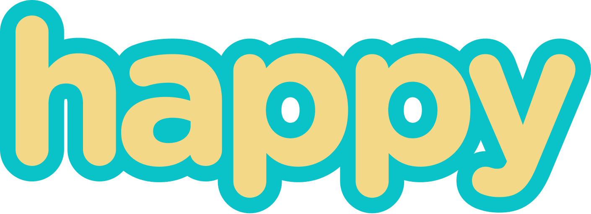

<h1 align="center">
    
</h1>

  <a href="#-tecnologias">Tecnologias</a>&nbsp;&nbsp;&nbsp;|&nbsp;&nbsp;&nbsp;
  <a href="#-projeto">Projeto</a>&nbsp;&nbsp;&nbsp;|&nbsp;&nbsp;&nbsp;
  <a href="#-layout">Layout</a>&nbsp;&nbsp;&nbsp;|&nbsp;&nbsp;&nbsp;
  <a href="#-desafio">Desafio</a>&nbsp;&nbsp;&nbsp;|&nbsp;&nbsp;&nbsp;
  <a href="#-como-contribuir">Contribuir</a>&nbsp;&nbsp;&nbsp;|&nbsp;&nbsp;&nbsp;
  <a href="#memo-licença">Licença</a>

 

  

  

  

  

  

## ⚙️ Tecnologias

Esse projeto foi desenvolvido com as seguintes tecnologias:

- [Node.js](https://nodejs.org/en/)
- [React Native](https://facebook.github.io/react-native/)
- [Expo](https://expo.io/)
- [TypeScript](https://www.typescriptlang.org/)
- [React Router Dom](https://reactrouter.com/web/guides/quick-start)
- [React Icons](https://react-icons.github.io/react-icons/)
- [React Native Maps](https://github.com/react-native-maps/react-native-maps)
- [Image Picker](https://docs.expo.io/versions/latest/sdk/imagepicker/)
- [Sqlite3](https://www.sqlite.org/index.html)
- **Code style**
  - [Eslint](https://eslint.org/)
  - [EditorConfig](https://editorconfig.org/)
  - [Prettier](https://prettier.io/)

## 💻 Projeto

O Happy é uma aplicação que conecta pessoas à casas de acolhimento institucional para fazer o dia de muitas crianças mais feliz 💜

## 🎨 Layout

No link abaixo você encontra o layout do projeto mobile completo. Lembrando que você precisa ter uma conta no [Figma](http://figma.com/) para acessá-lo e duplica-lo para os seus Drafts.

- [Layout Mobile](https://www.figma.com/file/X27FfVxAgy9f5IFa7ONlph/Happy-Mobile)

## 🧠 Desafio

No link a seguir você encontra o guia no Notion referente aos desafios propostos para que você possa percorrer a milha extra e incrementar ainda mais essa aplicação. Lá também você encontra um guia mostrando todo o passo a passo de como realizar o deploy tanto do backend quanto do frontend.

- [Desafio Happy 2.0](https://www.notion.so/Vers-o-2-0-do-Happy-c754db7a4d41469e8c2d00fcf75392c4)

## 🤔 Como contribuir

* Faça um fork desse repositório;
* Cria uma branch com a sua feature: `git checkout -b minha-feature` ;
* Faça commit das suas alterações: `git commit -m 'feat: Minha nova feature'` ;
* Faça push para a sua branch: `git push origin minha-feature` .

Depois que o merge da sua pull request for feito, você pode deletar a sua branch.

## :memo: Licença

Esse projeto está sob a licença MIT. Veja o arquivo [LICENSE](LICENSE) para mais detalhes.

---

Feito com 💜 by **mpgxc**
